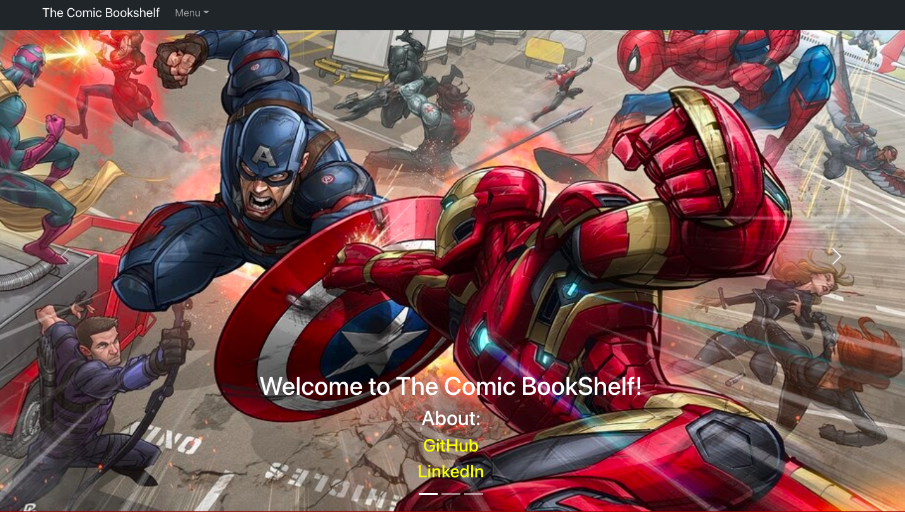
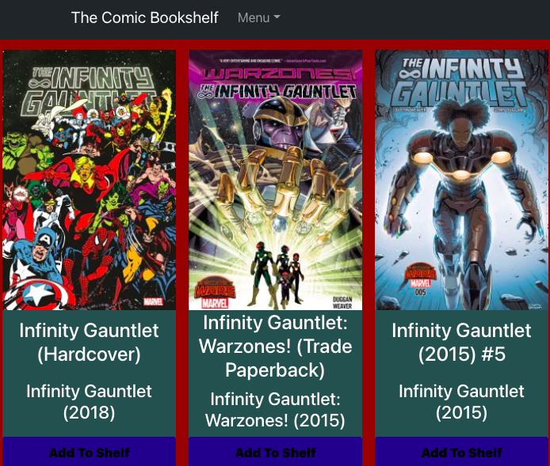
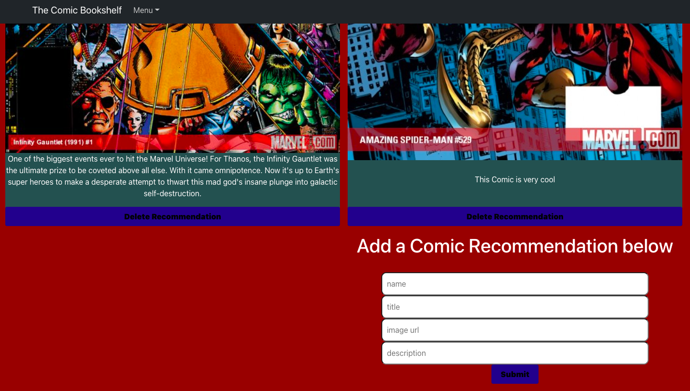

# The Comic BookShelf

## Date: 08/29/2021

### By: Brandon Hernandez

#### [GitHub](https://github.com/brandonhernandez123) | [LinkedIn](https://www.linkedin.com/in/brandonhdzgtz/)
***

### ***Description***
#### The Comic BookShelf is an app where you can search through a variety of different comic books and add it to your "Comic Bookshelf". You can also begin a recomendation thread where you can post a Comic book you highly recommend and why! This Project was created for the SEI program at General Assembly and was completed in a week to fully understand how to create a MERN full stack application
***

### ***Technologies Used***
  
 * Mongoose
* Express
* React
* Node
* React BootStrap 
 

***

### ***Getting Started***

##### A Trello board was used to keep track of development progress and can be viewed [here](https://trello.com/b/zCEmwWyy/the-comic-bookshelf).
##### The project itself was deployed and can be viewed [here](https://thecomicbookshelf.herokuapp.com/).
***

### ***Screenshots***

##### HomePage Screenshot

##### Search Screenshot

##### Recommended Comics Screenshot

***

### ***Future Updates***
- [ ] Use ComicVine API along with the Marvel API
- [ ] Add authentication
- [ ] add feature to view more comic details
- [ ] Add ability to add comics to users bookshelf
- [ ] Update Search functionality 
- [x] Use Marvel API
  
***

### ***Credits***

#####  [Marvel API](https://developer.marvel.com/)
##### [React Bootstrap](https://react-bootstrap.netlify.app/)
##### [How to use MD5](https://www.titanwolf.org/Network/q/abce4c5d-da5f-4b90-af3e-d4055c838ffc/y)
##### [Canva](https://www.canva.com/)

***